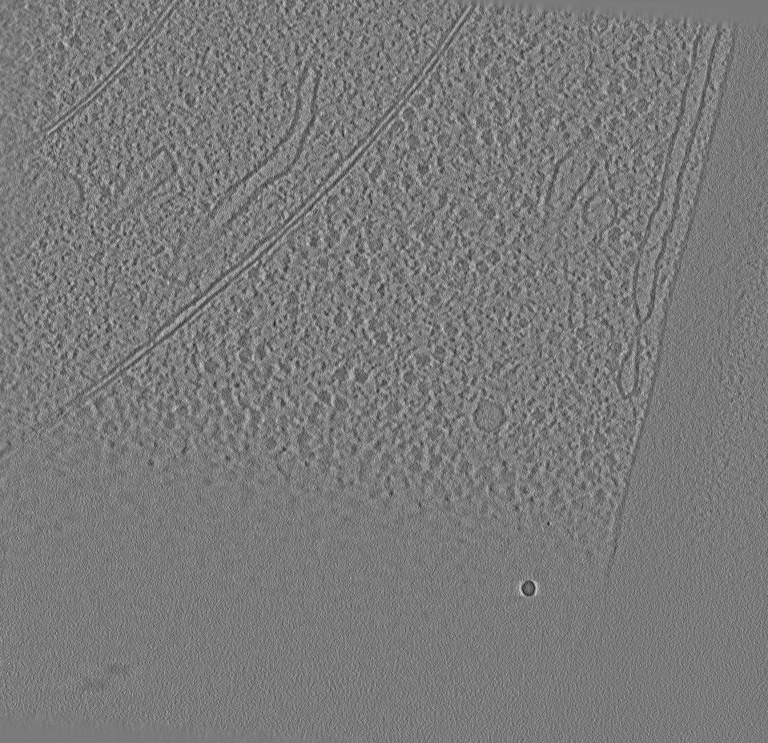
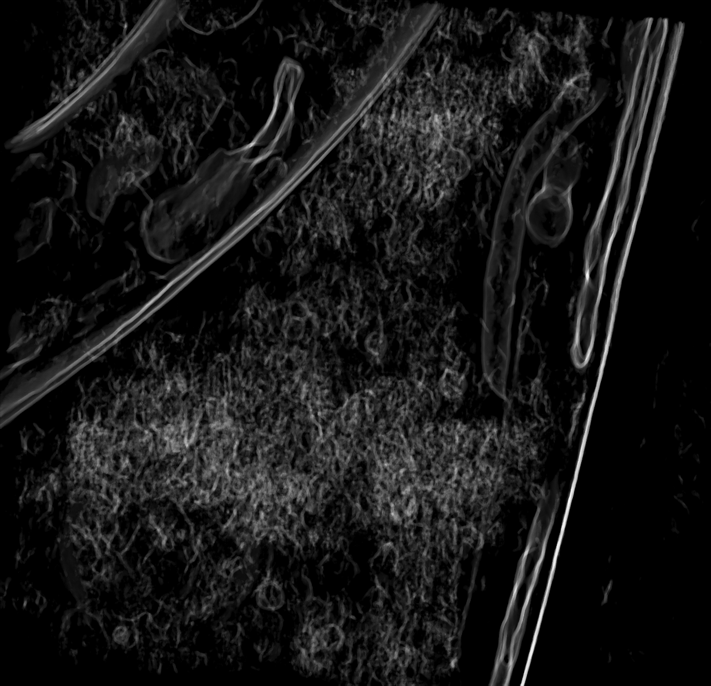
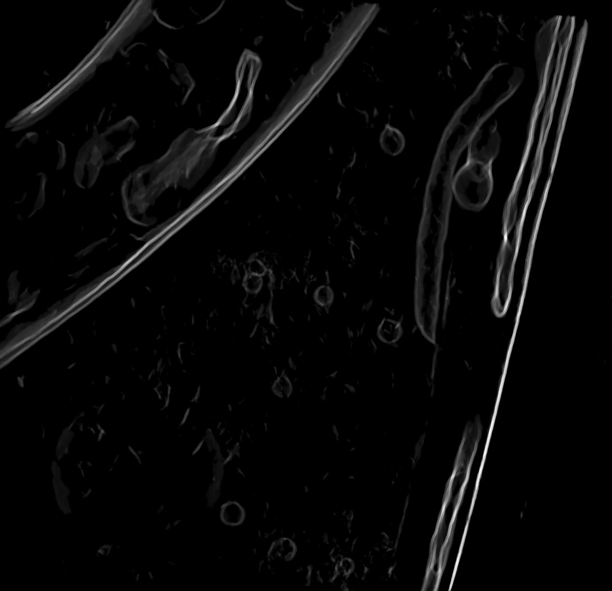
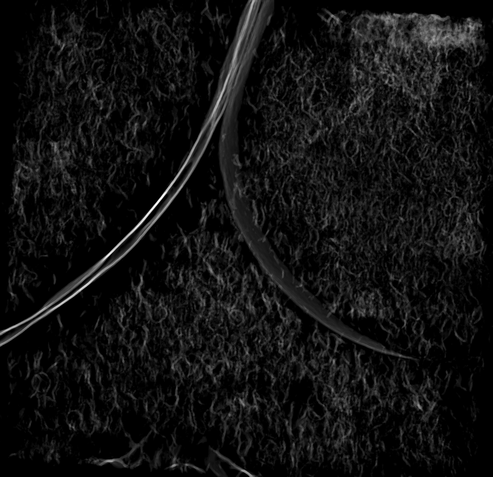
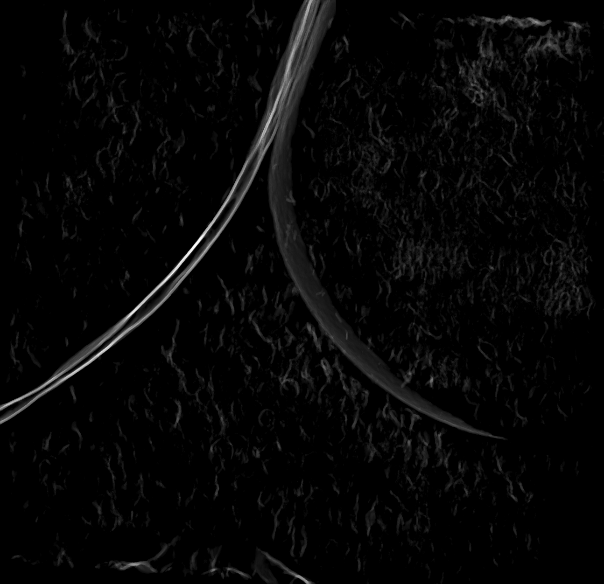
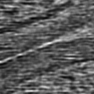

# F2FD-TTT: Test-time training with self-supervised Fourier-to-Fourier denoising for membrane segmentation in cryo-ET tomograms 🧊 🦠

This repository contains the implementation of [F2FD](https://github.com/Fickincool/F2Fd)-based denoising test-time training for membrane segmentation in cryo-electron tomography (cryo-ET). The goal is to improve segmentation performance on noisy tomograms by adapting the model at test time.

Examples from [EMPIAR-10988](https://www.ebi.ac.uk/empiar/EMPIAR-10988/):

| Raw slice | Membranes before TTT | Membranes after TTT |
| :---: | :---: | :---: |
|  |  |  |
|  |  |  |

Example from [MemBrain-seg dataset](https://zenodo.org/records/15089686):
| Raw slice | Membranes before TTT | Membranes after TTT |
| :---: | :---: | :---: |
|  |  |  |

## Quickstart ⚙️ 

Check the tutorial notebook under `tutorials/` for a quick overview.

## Installation
This project uses the [`uv`](https://github.com/astral-sh/uv) package manager for faster and more reliable Python dependency management.

To install `uv`, please refer to their [official installation guide](https://github.com/astral-sh/uv#installation).

After installing `uv`, install all project dependencies with:

```bash
uv sync --all-extras --no-install-project

# Activate the virtual env
source .venv/bin/activate
```

This repository uses Weights & Biases (W&B) for logging metrics and visualizations, login to your W&B account:

```bash
wandb login
```

## Training 🏋️‍♀️

To train the base segmentation model on your training dataset:

```bash
python -m ttt.training method=memdenoiseg
```

You can adjust hyperparameters and paths in the `configs/train_config.yaml` file.

The trained model checkpoints will be saved in the `checkpoints/` directory.

## Test-time training 📈

Once the base model is trained, you can perform denoising test-time training (TTT) to adapt the model to each new test tomogram:

```bash
python -m ttt.ttt --config configs/ttt_config.yaml --checkpoint checkpoints/best_model.pth
```

This will load the pre-trained model and fine-tune it on the test tomogram using self-supervised denoising objectives. The adapted segmentation will be saved to `outputs/`.

You can configure TTT hyperparameters (e.g., adaptation steps, learning rate, denoising loss) in `configs/ttt_config.yaml`.

## License ⚖️

This project is licensed under the MIT License. See `LICENSE` for details.
